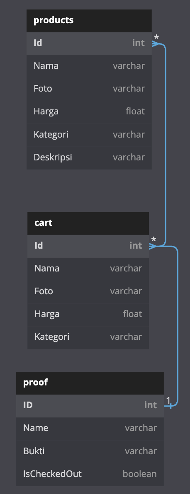
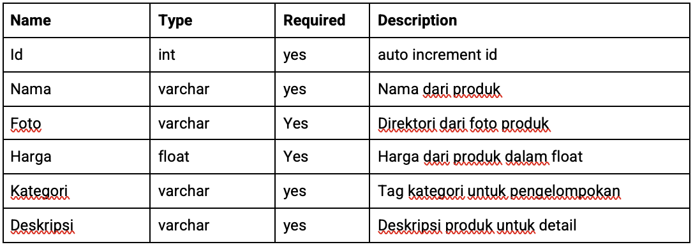
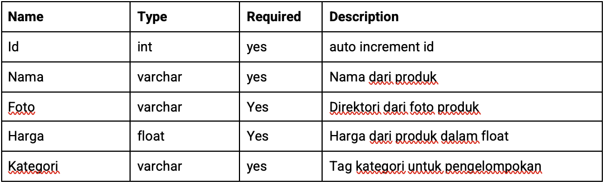
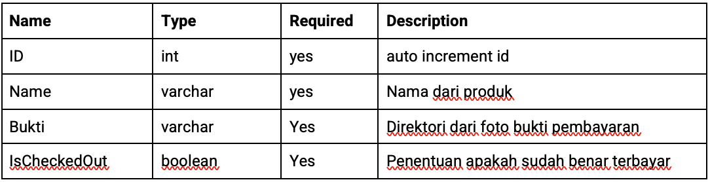
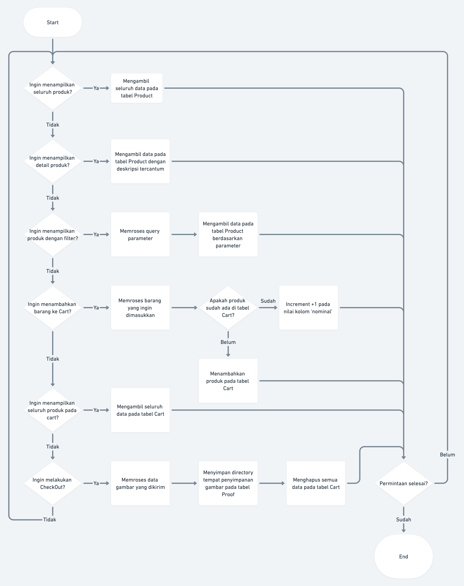
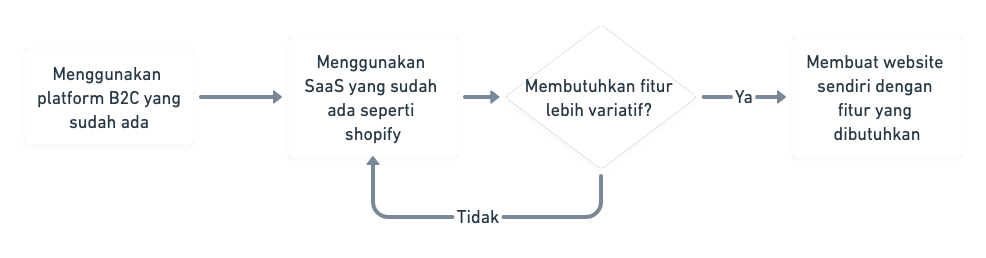

# EFISHERY-ECOMMERCE API SYSTEM #
- Expected Finish Date: 2022-11-11
- Author: Muhammad Hilmi Fawwaz
- Approvers: Efishery Academy Mentors


## Summary ##
    Efishery Ecommerce adalah sebuah layanan API untuk membantu keberjalanan pemilihan produk dan penunjukkan bukti pembayaran. 
    Layanan ini dibuat dalam bahasa Go dengan database Postgresql.

## Problem & Motivation ##
    Sebuah Startup seri B ingin melayani pelanggan secara digital melalui internet. Pelayanan yang ingin dicakup dalam sistem ecommerce ini adalah pengecekan barang, pemilihan barang yang ingin dibeli, serta pengiriman bukti pembayaran. 
    Desain arsitektur dibuat dengan sederhana supaya para Front End Engineer dapat melayani permintaan dengan mudah.

## How To Run Program ##
### Install & Start Server ###
1. Start your Postgresql server
2. Run this code in your directory of choice,
```bash
go get github.com/Hilmaww/efishery-ecommerce
cd efishery-ecommerce
go mod tidy
go run .
```

3. use my [Postman collection](efishery_ecommerce_API.postman_collection.json) to test it. Import the json into your Postman app, then send the message.
## Detailed Design ##
### Database Design ###
#### Database akan dibuat sebagai berikut, ####



#### Tabel ####
- Tabel Produk

- Tabel Cart

- Tabel Proof

### API Contract ###
* Dokumentasi API dapat dibaca [disini](https://app.swaggerhub.com/apis-docs/HILMIAMBARI27/efishery-ecommerce/1.0.0#/developers/GetProductList)
### Flowchart ###


## Dependencies ##
- Echo Framework & middleware
- Postgresql
- GORM

## Milestone/Deployment Strategy ##
### Adoption and Migration ###



## Drawbacks/Risks ##
- Server Down
- Database Breached

## Alternatives ##
- Open shop at other ecommerce platform
- Make own platform using Shopify

## Development Possibilities ##
- Membuat docker container dengan multistage
- learn ci/cd deployment
- Menambahkan User management
- Menambahkan Unit Testing

## Link to Deployment ##
* https://efishery-ecommerce-web.herokuapp.com/